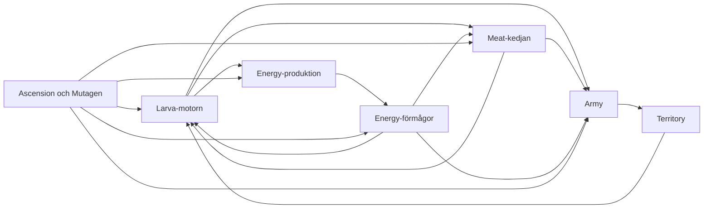

# Book 00 - Vision, Goals, and Dreams

Status: Strategic north star for SwarmSim Strategy Autobuyer.

This book explains why the project exists, the problem it ultimately aims to
solve, and the principles that should guide future strategy, architecture, and
test decisions.

It is intentionally more durable than a release plan. It does not claim that
every target described here is already implemented.

## Status vocabulary

Every major statement in this book uses one of these labels:

| Label | Meaning |
|-------|---------|
| `CURRENT` | Implemented or established in the current project. |
| `TARGET` | Agreed product and architecture direction. |
| `DREAM` | Long-term ambition that still needs research and staged implementation. |
| `NON-GOAL` | A direction the project explicitly rejects. |

The active runtime and its tests remain the authority for what the script
actually does today. `SWARMSIM_GAME_MODEL.md` remains the authority for current
game rules, planner contracts, and hard safety defaults.

## The product vision

`TARGET`

SwarmSim Strategy Autobuyer should decide, at each decision point, which
allowed action produces the best total progression toward the next strategic
milestone.

It should compare Meat, Larva, Army/Territory, Energy production, Energy
abilities, and Ascension/Mutagen across shared time horizons. Each comparison
must account for rebuild cost, opportunity cost, protected resources, risk,
and the effect of the action on the whole economy.

The project is therefore not merely an autobuyer. It is an explainable
strategic decision engine that can also act as an advisor.

## The central question

Every strategy change should help answer this question:

> Which allowed action gives the best total progression toward the next
> strategic milestone, over the relevant time horizon, after rebuild cost,
> opportunity cost, protected resources, and risk are considered?

The word **allowed** is essential. Hard safety blockers are applied before
optimization. A high projected value does not authorize an irreversible or
disabled action.

The words **total progression** are equally essential. Improving one lane's
local metric is not sufficient if the action makes the overall run worse.

## The six strategic questions

### 1. When should we invest in the Meat chain?

`CURRENT` Meat planning models sacrifice/rebuild progression, parent steps,
refill, Twin opportunities, reserves, and payback constraints.

`TARGET` A Meat proposal should express its value in shared outcomes: recovery
time, future production, milestone ETA, resources displaced from other lanes,
and the cost of waiting.

### 2. When should we invest in the Larva engine?

This includes Hatchery, Expansion, and related upgrades.

`CURRENT` Hatchery and Expansion are treated as a coupled Larva engine, with
save windows and protected-resource behavior.

`TARGET` Larva investment should be valued by its downstream contribution to
Meat, Army, Energy progression, abilities, and later milestones rather than by
Larva production in isolation.

### 3. When should we invest in Army and Territory?

`CURRENT` Army/Territory planning considers fighting-unit candidates,
Territory return, Expansion relevance, bounded purchases, and hard blockers.

`TARGET` Army/Territory proposals should include both direct Territory value
and downstream value through Expansion timing, Larva growth, army preparation,
and later ability opportunities.

### 4. When should we invest in Energy production?

This includes Lepidoptera, Nexus, and later Energy-producing units.

`CURRENT` Energy planning protects the Nexus objective and exposes Energy
opportunities without enabling unsafe default purchases or casts.

`TARGET` Energy-production proposals should value future ability capacity,
reserve recovery, cap waste, delayed alternatives, and their effect on the
whole progression path.

### 5. When should we ascend, and how should Mutagen be allocated?

`CURRENT` Ascension automation is disabled by default, and late-game Mutagen
strategy is not implementation-ready.

`TARGET` Ascension should begin as an explainable advisor decision that
compares the remaining value of the current run with the projected value of
resetting now. Mutagen allocation should be evaluated by its effect on the next
run and on future ascension time, not as an isolated upgrade ranking.

`DREAM` The system can model multiple future runs well enough to advise on an
Ascension and Mutagen plan with explicit uncertainty and evidence.

### 6. When should we use Energy abilities?

`CURRENT` Ability auto-cast remains disabled by default. Laboratory can compare
read-only counterfactuals for supported actions, and ability preparation is
observable and advisory.

`TARGET` Ability decisions should compare immediate gain with the value of
saving Energy for another ability or milestone. Clone Larvae connects Energy
to the Larva engine. House of Mirrors connects Energy to Army preparation.
Swarmwarp can change the value of investments across the economy.

Energy production and Energy spending are separate optimization problems. A
good production decision does not automatically imply that casting now is the
best use of the accumulated Energy.

## One economy, not six isolated planners

`TARGET`

The six questions form a feedback system:

- Larva enables Meat, Army, and parts of Energy progression.
- Meat progression can unlock or accelerate investments elsewhere, but may
  temporarily consume productive banks.
- Army creates Territory.
- Territory enables Expansion and therefore more Larva production.
- Energy production creates future ability capacity.
- Abilities can accelerate Larva, Meat, Army, or time-dependent progression.
- Ascension trades the current run for a stronger future economy.
- Mutagen changes the future value and timing of the other five domains.

No lane should be declared optimal solely because it improved its own local
score. A locally attractive action can be globally poor when it delays a more
important milestone or consumes a protected resource.

## The shared proposal contract

`TARGET`

Each strategic domain should be able to describe an action using comparable
outcomes, including:

- action and amount;
- legality and hard blockers;
- resources consumed and protected resources touched;
- immediate state change;
- rebuild or recovery time;
- projected production change;
- milestone ETA before and after;
- opportunity cost for the best alternatives;
- projections over relevant short, medium, and long horizons;
- uncertainty and evidence quality;
- explanation suitable for Council and Strategy Inspector.

Lane-specific diagnostics may remain specialized. Final ranking inputs must be
comparable. A raw score from one lane must not compete with a differently
scaled raw score from another lane as if the numbers had the same meaning.

## Time horizons and milestones

`TARGET`

The best action can change with the time horizon. A purchase may be weak over
one minute and decisive over thirty minutes. A reset may be harmful immediately
and optimal across the next run.

The decision engine should therefore reason over multiple relevant horizons
and name the milestone it is optimizing, such as:

- rebuild the productive chain;
- buy the next Hatchery or Expansion;
- reach the next Nexus;
- prepare a valuable ability window;
- reach a meaningful Territory threshold;
- reach an Ascension target;
- improve the next run through Mutagen.

Fixed example horizons can be useful for testing, but the architecture should
not assume that the same horizon is correct for every phase of the game.

## Desired decision architecture

### Domain models

`CURRENT` The project has planner lanes and proposal-like diagnostic surfaces.

`TARGET` Each domain model proposes legal actions and predicts their effects on
the shared economy. It does not decide the global winner by itself.

### Laboratory

`CURRENT` Laboratory is gated, manually triggered, read-only,
simulation-only, deterministic where contracted, and protected by live-state
non-mutation checks.

`TARGET` Laboratory provides counterfactual outcome models from the same
snapshot so alternatives can be compared without modifying the player's state.

### Strategic coordinator

`CURRENT` The Unified Purchase Evaluator coordinates the first reversible
purchase across several current lanes.

`TARGET` The coordinator compares shared projected outcomes, applies hard
blockers first, selects the best allowed action, and records why it beat the
most important alternatives.

### Safety layer

`CURRENT` Hard safety defaults protect irreversible, high-risk, or explicitly
disabled automation.

`TARGET` Safety remains independent from score. Optimization happens only
inside the set of actions allowed by the selected user mode and safety policy.

### Explanation layer

`CURRENT` Swarm Council, Strategy Inspector, and exports expose planner state
and decisions.

`TARGET` Every important decision explains the selected action, best rejected
alternatives, blockers, opportunity costs, time horizon, milestone, and model
confidence in language a player can evaluate.

## The automation dream

`DREAM`

The project should automatically test its strategic reasoning across the game
without requiring the user to become a manual test operator.

The desired test system includes:

- large seeded mathematical and property-based sweeps;
- generated states around costs, thresholds, unlocks, and competing lanes;
- deterministic Strategy Audit matrices using real production strategy;
- Laboratory-versus-runtime differential checks;
- metamorphic invariants for monotonicity, legality, safety, and consistency;
- disposable production-parity browser runs;
- reset, leakage, and non-mutation proof;
- automatic failure reproduction and state reduction;
- permanent regression fixtures for confirmed defects;
- a machine-readable coverage map of mechanics, lanes, blockers, thresholds,
  value ranges, and untested areas.

Millions of fast mathematical cases and large planner matrices are preferable
to millions of full browser sessions. Headed browser runs, screenshots, and
traces should focus on representative acceptance cases and failures.

## Product modes

`CURRENT` The project distinguishes autonomous optimization from advisory use,
while retaining hard safety defaults.

`TARGET`

- **Player Companion / Advisor:** explains the best next actions, risks, and
  timing without acting unless the user enables purchases.
- **Methodical Optimizer:** acts on well-supported reversible progression while
  respecting rebuild, opportunity cost, and hard blockers.
- **Higher-tempo modes:** may optimize more aggressively only when explicitly
  selected, observable, bounded, and still subject to hard safety rules unless
  the user separately changes those rules.

The modes may differ in acceptable risk, horizon, and action cadence. They
should not use incompatible models of game truth.

## Definition of success

`TARGET`

The system succeeds when it can:

1. identify the most relevant legal alternatives;
2. project how each alternative affects the whole economy;
3. compare those effects on a shared basis;
4. select or recommend the best action for the current milestone and horizon;
5. preserve hard safety boundaries;
6. explain why the winner was better than the alternatives;
7. reproduce and test the decision automatically;
8. express uncertainty when evidence is insufficient.

A legal purchase is not automatically a good purchase. A stable decision is
not automatically a correct decision. A passing scenario is not sufficient if
the tested state does not represent the strategic question.

## Non-goals

`NON-GOAL`

The project should not become:

- a blind buyMax loop;
- a highest-visible-unit buyer;
- six isolated lane optimizers with incomparable scores;
- an opaque system that cannot explain its winner;
- an automation system that treats a Laboratory simulation as permission to
  widen irreversible behavior;
- a test suite that manufactures planner answers;
- a collection of hand-tuned expectations written only to make tests pass;
- a system that requires the user to manually export large amounts of routine
  test evidence;
- an auto-ascender or ability auto-caster by default without explicit future
  authorization and separate evidence.

## How to use this book

Before proposing strategy or architecture work, ask:

> Does this make the system better at selecting the action that gives the best
> total progression, or does it only improve an isolated local metric?

Use this book to judge direction. Use the active game model to judge current
strategy contracts. Use the runtime and tests to judge implementation. Use the
remaining books to judge mechanics, evidence, audit findings, and external
claims.

## Relationship to the other books

- `BOOK-01-base-mechanics-and-claims.md`: established base mechanics and claims.
- `BOOK-02-energy-house-of-mirrors-and-lab.md`: Energy, abilities, and Laboratory.
- `BOOK-03-verification-history-and-artifacts.md`: verification and evidence map.
- `BOOK-04-strategy-intelligence-findings.md`: behavioral audit findings.
- `BOOK-05-community-strategy-claims.md`: external strategy claims and status.
