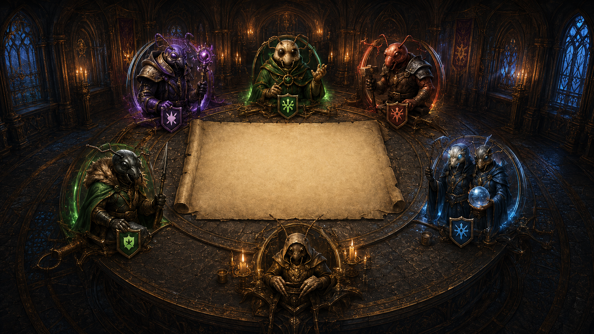

# BOOK-06 — Council Chamber UI and experience

## Purpose

This book is the durable product vision for how SwarmBot communicates its
thinking. BOOK-00 remains the strategic north star for what the bot should do.
BOOK-06 defines how a person should understand, trust, and control that work.

The UI is not decoration around a log. It is the bot's explanation layer.

## Status vocabulary

- **CURRENT** — exists in the product today.
- **TARGET** — accepted direction for the Council UI.
- **DREAM** — desirable later capability, not an active commitment.
- **NON-GOAL** — intentionally excluded from this track.

## Canonical visual north star

Reference asset:
`ui/reference/swarmbot-council-chamber-north-star.png`

Source image facts:

- dimensions: 1672 × 941 pixels
- SHA-256: `C335832DB2407D3558EDB75690A943FB9A014F0B2B4B35A7B58550081AE2CF01`
- role: composition and art-direction reference, not yet a runtime asset

The scene contains six stable council roles around a central parchment. This
composition is canonical unless a later, explicit visual decision replaces it.
The parchment must remain usable as the primary decision surface.

## Product surfaces

### TARGET — Council Chamber

The default, human-friendly overview. It should answer, in this order:

1. What does SwarmBot want to do now?
2. Why is that the best action?
3. Is it safe and executable?
4. What is the expected payback and reserve after the action?
5. What is each economic lane doing?
6. What happened recently?

### TARGET — Council Chronicle

A filterable timeline of recommendations, holds, warnings, purchases, refused
actions, fallbacks, and execution results. It must preserve causality: a user
should be able to follow recommendation → authority decision → execution.

### TARGET — Compact Council

A smaller surface for normal play. It keeps the current action, essential
safety state, lane progress, and latest events visible without occupying the
full screen.

### CURRENT / TARGET — Matrix Diagnostics

The dense expert view remains available for raw numbers, logs, and debugging.
It is a complementary mode, not the default product experience.

## Stable art, dynamic truth

The implementation separates two layers:

- **art layer:** chamber, council members, parchment texture, borders, emblems
- **information layer:** all text, values, progress, status, controls, focus,
  tooltips, timeline events, and accessibility semantics

Dynamic information must be rendered with HTML/CSS. It must never be baked
into generated artwork. This keeps the UI truthful, localizable, responsive,
testable, and readable at different sizes.

## The six council roles

The artwork represents stable domains, not autonomous strategy engines:

| Council role | Responsibility shown to the user |
|--------------|----------------------------------|
| Beetle Magus | Energy, abilities, Nexus protection |
| Larva Steward | Larvae, engine growth, clone preparation |
| Flesh Smith | Meat-chain growth and current meat action |
| General Mandible | Territory, army, expansion readiness |
| Twin Oracle | Thresholds, twins, upgrades, timing |
| Brood Architect | Long-term goal, rebuild, whole-economy coordination |

Names are presentation language. The canonical planner remains the source of
truth; the council must not invent a second strategy system.

## Information hierarchy

The central parchment is reserved for the current whole-economy decision:

- action and quantity
- one-sentence strategic reason
- payback or readiness estimate
- reserve state after action
- execution authority and outcome
- strongest blocker or reason to wait

Supporting panels show current phase, strategic goal, whole-economy winner,
lane states, and safety protections. The timeline explains how the current
state arose. Technical details are available progressively, not forced into the
primary reading path.

## Honesty contract

The Council UI must:

- display unavailable data as unavailable, never estimate silently
- distinguish measured values from derived presentation values
- distinguish recommendation, permission, attempt, and completed purchase
- expose coordinator refusal and fallback planner selection unambiguously
- preserve Decimal-derived precision until final display formatting
- keep Advisor Mode and Autobuyer Mode visually and semantically distinct
- never widen automation or change hard safety defaults through presentation

## Timeline principle

The Chronicle should consume a single, versioned UI event contract. Events are
emitted when decisions happen; the UI should not reconstruct causality later by
trying to merge unrelated text logs.

Minimum event families are recommendation, hold, warning, authority decision,
fallback, purchase attempt, purchase completed, purchase failed, and info.

## Visual direction

TARGET qualities:

- dark gothic insect chamber with restrained bronze framing
- lane colors used consistently: purple, green, amber, and blue
- warm parchment for the primary decision, with high-contrast live text
- motion used only to communicate change or urgency
- ornament never obscures state, controls, or reading order
- useful at ordinary laptop widths and under browser zoom

## Performance and accessibility

The full-screen view must remain usable without relying on color alone. Dynamic
text stays selectable and compatible with screen-reader semantics. Animation
respects reduced-motion preferences. Assets should be optimized and loaded in a
way compatible with the Tampermonkey delivery model selected in a later
milestone.

## NON-GOALS

- changing strategy behavior as part of a visual milestone
- replacing canonical planner data with council-character opinions
- embedding live values or labels in raster artwork
- hiding failures to make the chamber look calm
- removing the expert diagnostics view
- shipping large unoptimized generated images directly into the userscript

## Relationship to delivery work

This book changes slowly. Active implementation state and checklists live in:

- `ui/COUNCIL_UI_CURRENT_STATUS.md`
- `ui/COUNCIL_UI_PRODUCT_DELIVERY_RUNBOOK.md`
- `ui/COUNCIL_UI_DATA_MAP.md`
- `ui/COUNCIL_UI_STATE_CONTRACT.md`
- `ui/COUNCIL_TIMELINE_EVENT_CONTRACT.md`

UI milestones run parallel to strategy milestones. They may consume planner
data, but completing a UI milestone is not evidence that a strategy milestone
is complete, and vice versa.
